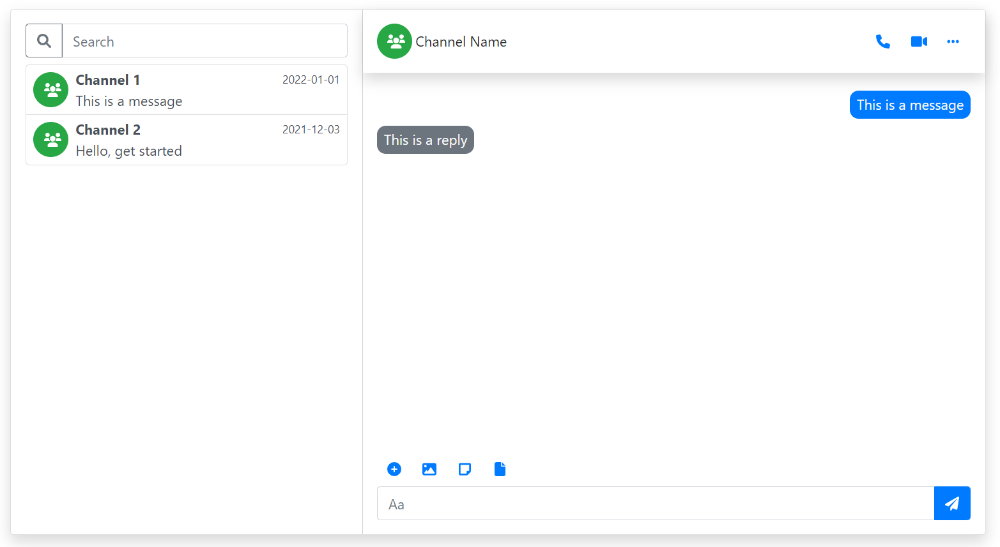

# React Bootstrap Chat UI

A collection of responsive UI components to build a chat application



## Getting Start

```bash
npm install react-bootstrap-chat-ui --save
```
or
```bash
yarn add react-bootstrap-chat-ui
```

## Usage

[An example](https://github.com/vu-luong/react-bootstrap-chat-ui/tree/main/example) is worth more than a thousand words

## Authors

[Vu Luong](http://vuluong.ml)

## License

MIT
